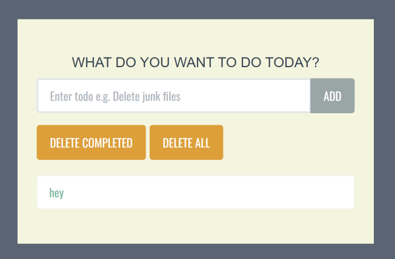

Simple Flask+MongoDB application to manage To-Do list.

Could be deployed to AWS ECS.



Based on https://www.youtube.com/watch?v=xjHEcmjlD-Y&feature=youtu.be  
https://github.com/PrettyPrinted/youtube_video_code/tree/master/2020/09/01/Beginner%20Flask%20Project:%20Create%20a%20Todo%20App%20With%20Flask%20and%20MongoDB


To run mongo in docker locally:
```
docker run -it --name mongo -p 27017:27017 -e MONGO_INITDB_DATABASE=mongo -e MONGO_INITDB_ROOT_USERNAME=admin -e MONGO_INITDB_ROOT_PASSWORD=password mongo
```

To download AWS certificate:

```
wget https://s3.amazonaws.com/rds-downloads/rds-combined-ca-bundle.pem
```

To build docker image and push it to ECR:
```
export AWS_ACCOUNT_ID="$(aws sts get-caller-identity --query "Account" --output text)" 
export AWS_REGION=us-east-1
export ECR_REPO=flask-mongodb-todo-list
aws ecr get-login-password --region $AWS_REGION | docker login --username AWS --password-stdin $AWS_ACCOUNT_ID.dkr.ecr.$AWS_REGION.amazonaws.com

docker build -t $AWS_ACCOUNT_ID.dkr.ecr.$AWS_REGION.amazonaws.com/$ECR_REPO .
docker push $AWS_ACCOUNT_ID.dkr.ecr.$AWS_REGION.amazonaws.com/$ECR_REPO:latest
```
